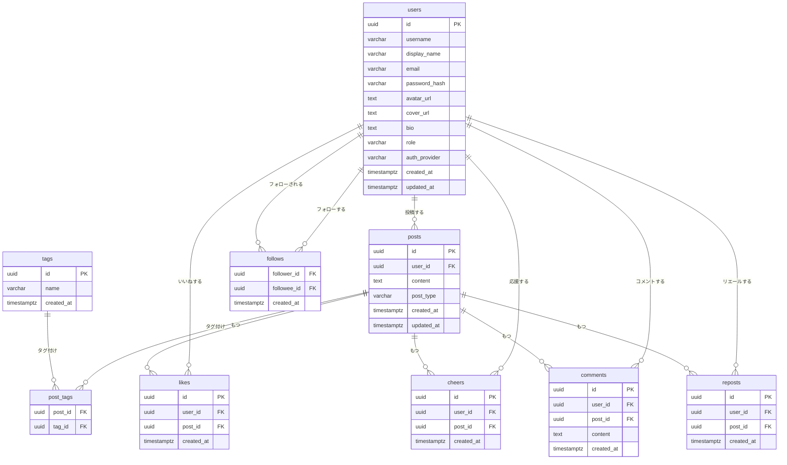

# DB設計

## エンティティ一覧

| # | エンティティ | 説明 |
|---|-------------|------|
| 1 | users | ユーザーアカウント |
| 2 | posts | エール（投稿） |
| 3 | tags | タグ |
| 4 | post_tags | 投稿とタグの中間テーブル |
| 5 | follows | フォロー関係 |
| 6 | likes | がんば！ |
| 7 | cheers | 応援 |
| 8 | comments | コメント |
| 9 | reposts | リエール（リポスト） |

## ER図

---

## テーブル定義

### users

| カラム | 型 | 制約 | 説明 |
|--------|---|------|------|
| id | UUID | PK | |
| username | VARCHAR(50) | UNIQUE, NOT NULL | |
| display_name | VARCHAR(100) | NOT NULL | |
| email | VARCHAR(255) | UNIQUE, NOT NULL | |
| password_hash | VARCHAR(255) | | メール認証時のみ |
| avatar_url | TEXT | | |
| cover_url | TEXT | | |
| bio | TEXT | | |
| role | VARCHAR(20) | DEFAULT 'general' | general / admin |
| auth_provider | VARCHAR(20) | DEFAULT 'email' | email / google |
| created_at | TIMESTAMPTZ | DEFAULT NOW() | |
| updated_at | TIMESTAMPTZ | DEFAULT NOW() | |

### posts

| カラム | 型 | 制約 | 説明 |
|--------|---|------|------|
| id | UUID | PK | |
| user_id | UUID | FK -> users, NOT NULL | |
| content | TEXT | NOT NULL | |
| post_type | VARCHAR(20) | DEFAULT 'normal' | normal / goal / daily_log / achievement |
| created_at | TIMESTAMPTZ | DEFAULT NOW() | |
| updated_at | TIMESTAMPTZ | DEFAULT NOW() | |

### tags

| カラム | 型 | 制約 | 説明 |
|--------|---|------|------|
| id | UUID | PK | |
| name | VARCHAR(50) | UNIQUE, NOT NULL | |
| created_at | TIMESTAMPTZ | DEFAULT NOW() | |

### post_tags

| カラム | 型 | 制約 | 説明 |
|--------|---|------|------|
| post_id | UUID | FK -> posts, PK | |
| tag_id | UUID | FK -> tags, PK | |

### follows

| カラム | 型 | 制約 | 説明 |
|--------|---|------|------|
| follower_id | UUID | FK -> users, PK | フォローする側 |
| followee_id | UUID | FK -> users, PK | フォローされる側 |
| created_at | TIMESTAMPTZ | DEFAULT NOW() | |

### likes

| カラム | 型 | 制約 | 説明 |
|--------|---|------|------|
| id | UUID | PK | |
| user_id | UUID | FK -> users, NOT NULL | |
| post_id | UUID | FK -> posts, NOT NULL | |
| created_at | TIMESTAMPTZ | DEFAULT NOW() | |

### cheers

| カラム | 型 | 制約 | 説明 |
|--------|---|------|------|
| id | UUID | PK | |
| user_id | UUID | FK -> users, NOT NULL | |
| post_id | UUID | FK -> posts, NOT NULL | |
| created_at | TIMESTAMPTZ | DEFAULT NOW() | |

### comments

| カラム | 型 | 制約 | 説明 |
|--------|---|------|------|
| id | UUID | PK | |
| user_id | UUID | FK -> users, NOT NULL | |
| post_id | UUID | FK -> posts, NOT NULL | |
| content | TEXT | NOT NULL | |
| created_at | TIMESTAMPTZ | DEFAULT NOW() | |

### reposts

| カラム | 型 | 制約 | 説明 |
|--------|---|------|------|
| id | UUID | PK | |
| user_id | UUID | FK -> users, NOT NULL | |
| post_id | UUID | FK -> posts, NOT NULL | |
| created_at | TIMESTAMPTZ | DEFAULT NOW() | |

---

## インデックス

（検討中）