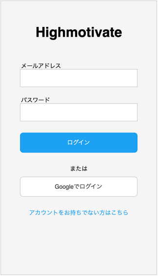
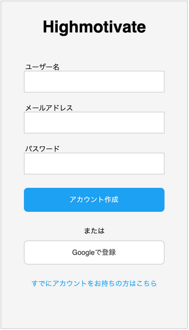
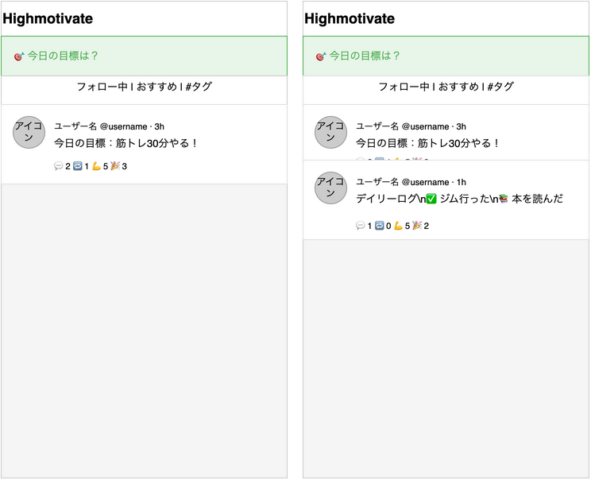
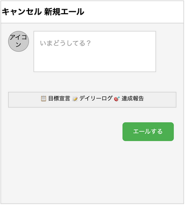
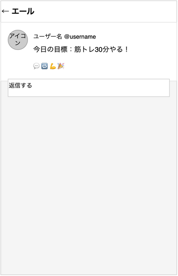
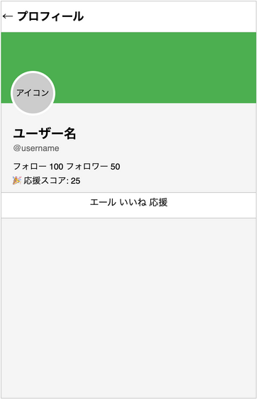
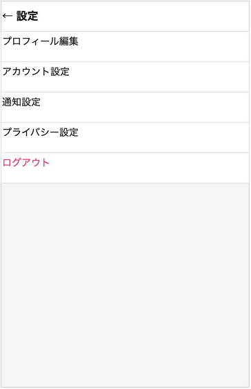
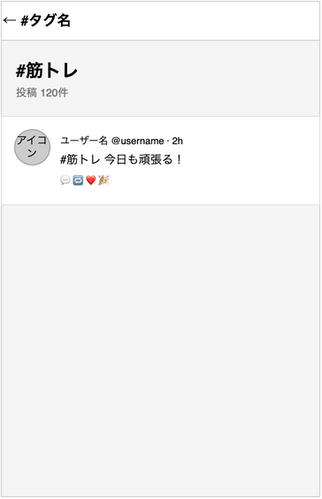

# 画面設計

## 画面一覧

| # | 画面名 | 説明 |
|---|--------|------|
| 1 | ログイン画面 | メール/Google OAuth認証 |
| 2 | サインアップ画面 | 新規アカウント登録 |
| 3 | タイムライン画面 | メインフィード（フォロー中＋おすすめ） |
| 4 | 投稿画面 | 新規投稿作成 |
| 5 | 投稿詳細画面 | 個別投稿とコメント表示 |
| 6 | プロフィール画面 | ユーザープロフィール表示・編集 |
| 7 | 設定画面 | アカウント設定全般 |
| 8 | タグフィルター画面 | 特定タグの投稿のみ表示 |
| 9 | ユーザー検索画面 | ユーザー検索・一覧 |

## 画面遷移図

（未作成）

---

## 各画面の構成

### 1. ログイン画面

**構成要素:**
- アップロゴ「Highmotivate」
- メールアドレス入力欄
- パスワード入力欄
- ログインボタン（プライマリカラー）
- 「または」区切り
- Googleでログインボタン
- サインアップへの導線リンク

### 2. サインアップ画面

**構成要素:**
- アップロゴ「Highmotivate」
- ユーザー名入力欄
- メールアドレス入力欄
- パスワード入力欄
- アカウント作成ボタン
- Googleで登録ボタン
- ログイン画面への導線リンク

### 3. タイムライン画面

**構成要素:**
- ヘッダー: アップロゴ
- 🎯 **今日の目標入力バー**（常設、タップで目標宣言エール）
- タブ切り替え: フォロー中 / おすすめ / #タグ
- エールカード（アイコン、ユーザー名、本文、アクション）
- アクション: 💬コメント 🔁リエール 💪がんば！ 🎉応援

### 4. 投稿画面（新規エール）

**構成要素:**
- ヘッダー: キャンセル / 新規エール
- ユーザーアイコン
- テキスト入力エリア（プレースホルダー: いまどうしてる？）
- テンプレート選択バー: 目標宣言 / デイリーログ / 達成報告
- エールするボタン（テーマカラー: 緑）

### 5. エール詳細画面

**構成要素:**
- ヘッダー: 戻る / エール
- エール本文（アイコン、ユーザー名、本文）
- アクションボタン: 💬 🔁 💪がんば！ 🎉応援
- 返信入力欄

### 6. プロフィール画面

**構成要素:**
- ヘッダー: 戻る / プロフィール
- カバー画像（テーマカラー: 緑）
- ユーザーアイコン
- ユーザー名 / @username
- フォロー・フォロワー数
- 🎉 応援スコア
- タブ: エール / いいね / 応援

### 7. 設定画面

**構成要素:**
- ヘッダー: 戻る / 設定
- 設定項目一覧:
  - プロフィール編集
  - アカウント設定
  - 通知設定
  - プライバシー設定
  - ログアウト

### 8. タグフィルター画面

**構成要素:**
- ヘッダー: 戻る / #タグ名
- タグ情報（タグ名、投稿件数）
- タグが付いた投稿のタイムライン

### 9. ユーザー検索画面

（未記入）

---

## 画面遷移図

（未作成）